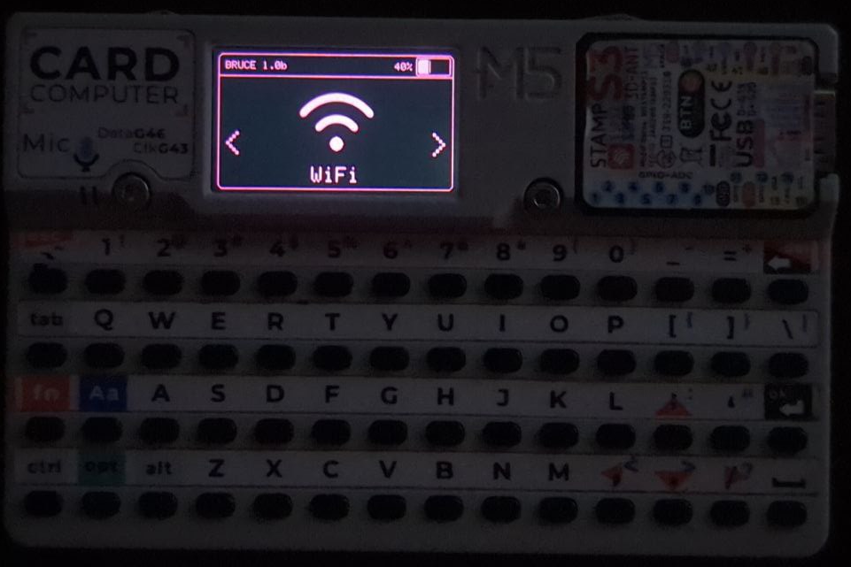
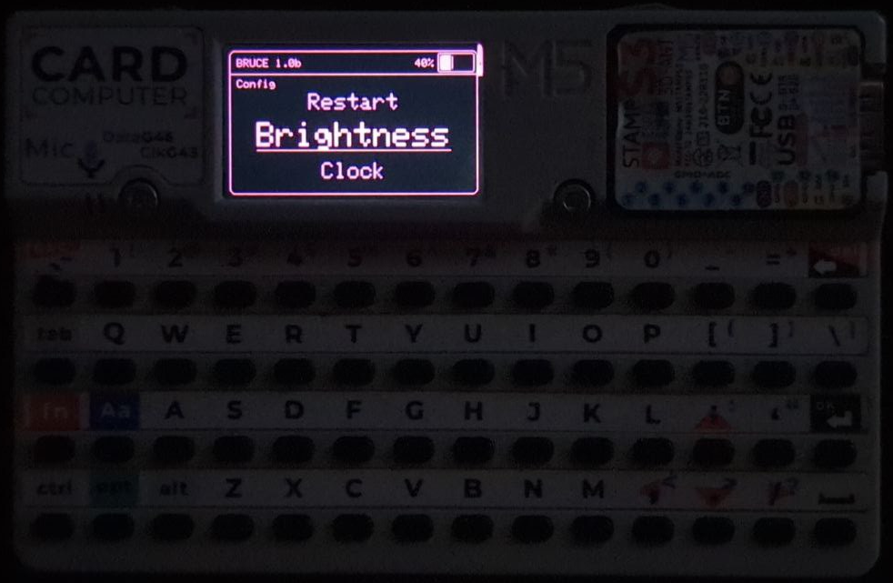

# Bruce

Bruce is meant to be a versatile ESP32 firmware that supports a ton of offensive features focusing to facilitate on Red Team operations.
It also supports m5stack products and works great with Cardputer and Sticks.

# Why and how does it look?

Bruce stems from a keen observation within the community focused on devices like Flipper Zero. While these devices offered a glimpse into the world of offensive security, there was a palpable sense that something more could be achieved without being that overpriced, particularly with the robust and modular hardware ecosystem provided by m5stack products.





# How to install

## For m5stack devices
The easiest way to install Bruce is if you already use M5Launcher to manage your m5stack device, you can install it with OTA

Or you can burn it directly from the [m5burner tool](https://docs.m5stack.com/en/download), just search for 'Bruce' (My official builds will be uploaded by "owner" and have photos.) on the device category you want to and click on burn

Alternatively you can also download the latest binary from releases and flash locally using esptool.py
```sh
esptool.py --port /dev/ttyACM0 write_flash 0x00000 Bruce.bin
```
or use a web flasher like https://web.esphome.io/

# Wiki
For more information on each function supported by Bruce, [read our wiki here](https://github.com/pr3y/Bruce/wiki).

# List of Features

## WiFi
- [x] Connect to WiFi (New)
- [x] WiFi AP (New)
- [x] Disconnect WiFi (New)
- [X] WiFi Atks
    - [x] Beacon Spam
    - [x] Target Atk
        - [x] Information
        - [X] Target Deauth
        - [X] EvilPortal + Deauth
    - [ ] Deauth Flood (More than one target)
- [X] TelNet
- [X] SSH
- [x] RAW Sniffer
- [x] DPWO-ESP32
- [x] Evil Portal (New features, SPIFFS and SDCard)
- [X] Scan Hosts
- [x] Wireguard Tun

## BLE
- [X] AppleJuice
- [X] SwiftPair
- [X] Android Spam (New?)
- [X] Samsung (New)
- [X] SourApple
- [X] BT Maelstrom

## RF
- [x] Jammer Full (New) - @incursiohack
- [x] Jammer Intermittent (New) - @incursiohack
- [x] Spectrum (New) - @incursiohack
- [ ] Scan/Copy (New)
- [ ] Replay


## RFID
- [x] Read and Write - @incursiohack

## Others
- [x] TV-B-Gone
- [x] SD Card Mngr (New)
- [x] SPIFFS Mngr (New)
- [x] WebUI (New)
    - [x] Server Structure
    - [x] Html
    - [x] SDCard Mngr
    - [x] Spiffs Mngr
- [x] Megalodon (New)
- [x] Custom IR (New, SPIFFS and SDCard)
- [x] BADUsb (New features, SPIFFS and SDCard)
- [X] Openhaystack

## Settings
- [x] Brightness
- [x] Orientation
- [x] Clock (New)
- [x] Restart

# Acknowledgements

+ [@bmorcelli](https://github.com/bmorcelli) for new core and a bunch of new features.
+ [@IncursioHack](https://github.com/IncursioHack) for adding RF and RFID modules features.
+ [@Luidiblu](https://github.com/Luidiblu) for logo and UI design assistance.
 
# Disclaimer

Bruce is a tool for cyber offensive and red team operations, distributed under the terms of the Affero General Public License (AGPL). It is intended for legal and authorized security testing purposes only. Use of this software for any malicious or unauthorized activities is strictly prohibited. By downloading, installing, or using Bruce, you agree to comply with all applicable laws and regulations. This software is provided free of charge, and we do not accept payments for copies or modifications. The developers of Bruce assume no liability for any misuse of the software. Use at your own risk.
