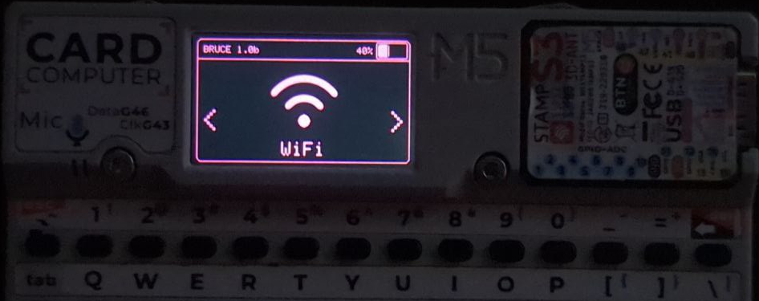
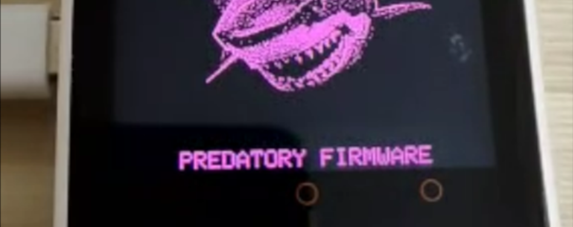
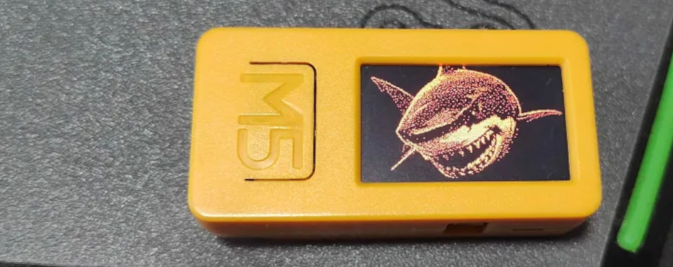
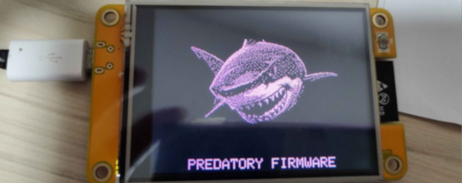

# :shark: Bruce

Bruce is meant to be a versatile ESP32 firmware that supports a ton of offensive features focusing on facilitating Red Team operations.
It also supports m5stack products and works great with Cardputer, Sticks, M5Cores, T-Decks and T-Embeds.

## :building_construction: How to install

### The easiest way to install Bruce is using our official Web Flasher!
### Check out: https://bruce.computer/flasher

Alternatively, you can download the latest binary from releases or actions and flash locally using esptool.py
```sh
esptool.py --port /dev/ttyACM0 write_flash 0x00000 Bruce-<device>.bin
```

**For m5stack devices**

If you already use M5Launcher to manage your m5stack device, you can install it with OTA

Or you can burn it directly from the [m5burner tool](https://docs.m5stack.com/en/download), just search for 'Bruce' (My official builds will be uploaded by "owner" and have photos.) on the device category you want to and click on burn


## :keyboard: Discord Server

Contact us in our [Discord Server](https://discord.gg/WJ9XF9czVT)!

## :bookmark_tabs: Wiki

For more information on each function supported by Bruce, [read our wiki here](https://github.com/pr3y/Bruce/wiki).
Also, [read our FAQ](https://github.com/pr3y/Bruce/wiki/FAQ)

## :computer: List of Features

<details>
  <summary><h2>WiFi</h2></summary>

- [x] Connect to WiFi
- [x] WiFi AP
- [x] Disconnect WiFi
- [x] [WiFi Atks](https://github.com/pr3y/Bruce/wiki/WiFi#wifi-atks)
  - [x] [Beacon Spam](https://github.com/pr3y/Bruce/wiki/WiFi#beacon-spam)
  - [x] [Target Atk](https://github.com/pr3y/Bruce/wiki/WiFi#target-atk)
    - [x] Information
    - [x] Target Deauth
    - [x] EvilPortal + Deauth
  - [x] Deauth Flood (More than one target)
- [x] [Wardriving](https://github.com/pr3y/Bruce/wiki/Wardriving)
- [x] [TelNet](https://github.com/pr3y/Bruce/wiki/WiFi#telnet)
- [x] [SSH](https://github.com/pr3y/Bruce/wiki/WiFi#ssh)
- [x] [RAW Sniffer](https://github.com/pr3y/Bruce/wiki/WiFi#raw-sniffer)
- [x] [TCP Client](https://github.com/pr3y/Bruce/wiki/WiFi#tcp-client)
- [x] [TCP Listener](https://github.com/pr3y/Bruce/wiki/WiFi#tcp-listener)
- [x] [Evil Portal](https://github.com/pr3y/Bruce/wiki/WiFi#evil-portal)
- [x] [Scan Hosts](https://github.com/pr3y/Bruce/wiki/WiFi#evil-portal)
- [x] [Wireguard Tunneling](https://github.com/pr3y/Bruce/wiki/WiFi#wireguard-tunneling)
- [x] Brucegotchi
  - [x] Pwnagotchi friend
  - [x] Pwngrid spam faces & names
    - [x] [Optional] DoScreen a very long name and face
    - [x] [Optional] Flood uniq peer identifiers

</details>

<details>
  <summary><h2>BLE</h2></summary>

- [X] [BLE Scan](https://github.com/pr3y/Bruce/wiki/BLE#ble-scan)
- [X] Bad BLE - Run Ducky scripts, similar to [BadUsb](https://github.com/pr3y/Bruce/wiki/Others#badusb)
- [X] BLE Keyboard - Cardputer and T-Deck Only
- [X] iOS Spam
- [X] Windows Spam
- [X] Samsung Spam
- [X] Android Spam
- [X] Spam All
</details>


<details>
  <summary><h2>RF</h2></summary>

- [x] Scan/Copy
- [x] [Custom SubGhz](https://github.com/pr3y/Bruce/wiki/RF#replay-payloads-like-flipper)
- [x] Spectrum
- [x] Jammer Full (sends a full squared wave into output)
- [x] Jammer Intermittent (sends PWM signal into output)
- [x] Config
    - [X] RF TX Pin
    - [X] RF RX Pin
    - [X] RF Module
        - [x] RF433 T/R M5Stack
        - [x] [CC1101 (Sub-Ghz)](https://github.com/pr3y/Bruce/wiki/CC1101)
    - [X] RF Frequency
- [x] Replay
</details>

<details>
  <summary><h2>RFID</h2></summary>

- [x] Read tag
- [x] Read 125kHz
- [x] Clone tag
- [x] Write NDEF records
- [x] Amiibolink
- [x] Chameleon
- [x] Write data
- [x] Erase data
- [x] Save file
- [x] Load file
- [x] Config
    - [X] [RFID Module](https://github.com/pr3y/Bruce/wiki/RFID#supported-modules)
        - [x] PN532
        - [x] PN532Killer
- [ ] Emulate tag
</details>

<details>
  <summary><h2>IR</h2></summary>

- [x] TV-B-Gone
- [x] IR Receiver
- [x] [Custom IR (NEC, NECext, SIRC, SIRC15, SIRC20, Samsung32, RC5, RC5X, RC6)](https://github.com/pr3y/Bruce/wiki/IR#replay-payloads-like-flipper)
- [x] Config
    - [X] Ir TX Pin
    - [X] Ir RX Pin
</details>

<details>
  <summary><h2>FM</h2></summary>

- [x] [Broadcast standard](https://github.com/pr3y/Bruce/wiki/FM#play_or_pause_button-broadcast-standard)
- [x] [Broadcast reserved](https://github.com/pr3y/Bruce/wiki/FM#no_entry_sign-broadcast-rerserved)
- [x] [Broadcast stop](https://github.com/pr3y/Bruce/wiki/FM#stop_button-broadcast-stop)
- [ ] [FM Spectrum](https://github.com/pr3y/Bruce/wiki/FM#ocean-fm-spectrum)
- [ ] [Hijack Traffic Announcements](https://github.com/pr3y/Bruce/wiki/FM#car-hijack-ta)
- [ ] [Config](https://github.com/pr3y/Bruce/wiki/FM#bookmark_tabs-config)
</details>

<details>
  <summary><h2>NRF24</h2></summary>

- [X] [NRF24 Jammer](https://github.com/pr3y/Bruce/wiki/BLE#nrf24-jammer)
- [X] 2.4G Spectrum
- [ ] Mousejack
</details>

<details>
  <summary><h2>Scripts</h2></summary>

- [X] [JavaScript Interpreter](https://github.com/pr3y/Bruce/wiki/Interpreter) [Credits to justinknight93](https://github.com/justinknight93/Doolittle)
</details>

<details>
  <summary><h2>Others</h2></summary>

- [X] Mic Spectrum
- [X] QRCodes
    - [x] Custom
    - [x] PIX (Brazil bank transfer system)
- [x] [SD Card Mngr](https://github.com/pr3y/Bruce/wiki/Others#sd-card-mngr)
    - [x] View image (jpg)
    - [x] File Info
    - [x] [Wigle Upload](https://github.com/pr3y/Bruce/wiki/Wardriving#how-to-upload)
    - [x] Play Audio
    - [x] View File
- [x] [LittleFS Mngr](https://github.com/pr3y/Bruce/wiki/Others#littlefs-mngr)
- [x] [WebUI](https://github.com/pr3y/Bruce/wiki/Others#webui)
    - [x] Server Structure
    - [x] Html
    - [x] SDCard Mngr
    - [x] Spiffs Mngr
- [x] Megalodon
- [x] [BADUsb (New features, LittleFS and SDCard)](https://github.com/pr3y/Bruce/wiki/Others#badusb)
- [x] USB Keyboard - Cardputer and T-Deck Only
- [x] [iButton](https://github.com/pr3y/Bruce/wiki/Others#ibutton)
- [x] [LED Control](https://github.com/pr3y/Bruce/wiki/Others#led-control)
</details>

<details>
  <summary><h2>Clock</h2></summary>

- [X] RTC Support
- [X] NTP time adjust
- [X] Manual adjust
</details>

<details>
  <summary><h2>Connect (ESPNOW)</h2></summary>

- [X] Send File
- [X] Receive File
- [X] Send Commands
- [X] Receive Commands
</details>

<details>
  <summary><h2>Config</h2></summary>

- [x] Brightness
- [x] Dim Time
- [x] Orientation
- [X] UI Color
- [x] Boot Sound on/off
- [x] Clock
- [x] Sleep
- [x] Restart
</details>

## Specific functions per Device, the ones not mentioned here are available to all.
| Device                  | CC1101    | NRF24    | FM Radio  | PN532     | Mic   | BadUSB    | RGB Led | Speaker   | Fuel Guage | LITE_VERSION |
| ---                     | :---:     | :---:    | :---:     | :---:     | :---: | :---:     | :---:   | :---:     | :---:      | :---:     |
| [M5Stack Cardputer](https://shop.m5stack.com/products/m5stack-cardputer-kit-w-m5stamps)       | :ok:      | :ok:     | :ok:      | :ok:      | :ok:  | :ok:      | :ok:    | NS4168    | :x:        | :x:       |
| [M5Stack M5StickC PLUS2](https://shop.m5stack.com/products/m5stickc-plus2-esp32-mini-iot-development-kit)  | :ok:      | :ok:         | :ok:      | :ok:      | :ok:  | :ok:¹     | :x:     | Tone      | :x:        | :x:       |
| [M5Stack M5StickC PLUS](https://shop.m5stack.com/products/m5stickc-plus-esp32-pico-mini-iot-development-kit)   | :ok:      | :ok:          | :ok:      | :ok:      | :ok:  | :ok:¹     | :x:     | Tone      | :x:        | :x:²     |
| [M5Stack M5Core BASIC](https://shop.m5stack.com/products/basic-core-iot-development-kit)    | :ok:        | :ok:       | :ok:       | :ok:        | :ok:  | :ok:¹     | :x:     | Tone      | :x:        | :x:       |
| [M5Stack M5Core2](https://shop.m5stack.com/products/m5stack-core2-esp32-iot-development-kit-v1-1)    | :ok:        | :ok:          | :ok:        | :ok:        | :ok:  | :ok:¹     | :x:     | :x:       | :x:        | :x:       |
| [M5Stack M5CoreS3](https://shop.m5stack.com/products/m5stack-cores3-esp32s3-lotdevelopment-kit)/[SE](https://shop.m5stack.com/products/m5stack-cores3-se-iot-controller-w-o-battery-bottom)     | :ok:        | :ok:         | :ok:        | :ok:        | :x:   | :ok:      | :x:     | :x:       | :x:        | :x:       |
| [JCZN CYD&#x2011;2432S028](https://www.aliexpress.us/item/3256804774970998.html)       | :ok:      | :ok:     | :ok:       | :ok:      | :x:   | :ok:¹     | :x:     | :x:       | :x:        | :x:²      |
| [Lilygo T&#x2011;Embed CC1101](https://lilygo.cc/products/t-embed-cc1101)   | :ok:      | :ok:         | :ok:       | :ok:      | :ok:  | :ok:      | :ok:    | :ok:      | :ok:       | :x:       |
| [Lilygo T&#x2011;Embed](https://lilygo.cc/products/t-embed)          | :ok:       | :ok:      | :ok:       | :ok:      | :ok:  | :ok:      | :ok:    | :ok:      | :x:        | :x:       |
| [Lilygo T-Display-S3](https://lilygo.cc/products/t-display-s3) | :ok:       | :ok:      | :x:       | :x:       | :x:   | :ok:      | :x:     | :x:       | :x:        | :x:       |
| [Lilygo T&#x2011;Deck](https://lilygo.cc/products/t-deck) ([and pro](https://lilygo.cc/products/t-deck-plus-1)) | :ok:       | :x:      | :x:       | :x:       | :x:   | :ok:      | :x:     | :x:       | :x:        | :x:       |
| [Lilygo T-Watch-S3](https://lilygo.cc/products/t-watch-s3) | :x:       | :x:      | :x:       | :x:       | :x:   | :ok:      | :x:     | :x:       | :x:        | :x:       |

² CYD have a LITE_VERSION version for Launcher Compatibility
¹ Core, CYD and StickCs Bad-USB: [here](https://github.com/pr3y/Bruce/wiki/Others#badusb)

*LITE_VERSION*: TelNet, SSH, WireGuard, ScanHosts, RawSniffer, Brucegotchi, BLEBacon, BLEScan and Interpreter are NOT available for M5Launcher Compatibility


## :sparkles: Why and how does it look?

Bruce stems from a keen observation within the community focused on devices like Flipper Zero. While these devices offered a glimpse into the world of offensive security, there was a palpable sense that something more could be achieved without being that overpriced, particularly with the robust and modular hardware ecosystem provided by ESP32 Devices, Lilygo and M5Stack products.






Other media can be [found here](./media/).

## :clap: Acknowledgements

+ [@bmorcelli](https://github.com/bmorcelli) for new core and a bunch of new features, also porting to many devices!
+ [@IncursioHack](https://github.com/IncursioHack) for adding RF and RFID modules features.
+ [@Luidiblu](https://github.com/Luidiblu) for logo and UI design assistance.
+ [@eadmaster](https://github.com/eadmaster) for adding a lot of features.
+ [@rennancockles](https://github.com/rennancockles) for a lot of RFID code, refactoring and others features.
+ [@7h30th3r0n3](https://github.com/7h30th3r0n3) refactoring and a lot of help with WiFi attacks.
+ [@Tawank](https://github.com/Tawank) refactoring interpreter among many other things
+ [@pablonymous]() new RF functions to read RAW Data
+ [Smoochiee]() for Bruce PCB design.
+ [TH3_KR4K3N]() for Stick cplus extender PCB design.
+ Everyone who contributed in some way to the project, thanks :heart:

## :construction: Disclaimer

Bruce is a tool for cyber offensive and red team operations, distributed under the terms of the Affero General Public License (AGPL). It is intended for legal and authorized security testing purposes only. Use of this software for any malicious or unauthorized activities is strictly prohibited. By downloading, installing, or using Bruce, you agree to comply with all applicable laws and regulations. This software is provided free of charge, and we do not accept payments for copies or modifications. The developers of Bruce assume no liability for any misuse of the software. Use at your own risk.

