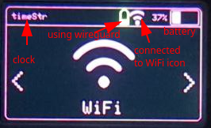

# Building from source

## VS Code
You can open the project folder on Visual Studio Code with PlatformIO extension and click on "PlatformIO: Build" on the bottom.
After compiling the project, you need to merge the bootloader, partitions and the actual firmware on a single one, for that you can run the shell scripts "build.sh" or "build.bat", which will use esptool.py to output the binaries.
```sh
git clone https://github.com/pr3y/Bruce.git
cd Bruce
<compile the project on VS Code using PlatformIO>
./build.sh
```
With this you will have 3 .bin files on the project folder, with they being the build for M5Cardputer, M5StickC Plus 1.1, M5StickC Plus 2. 

## Github
You can also use the Github workflow to build the binaries for you with Actions, the last releases are also available there on the Artefacts, but you can also fork the project and make the changes you want to this, then build on your own Actions also.

----------------------
# Interface


----------------------

# WiFi

## WiFi Atks

### Beacon Spam

### Target Atk
Scans for a WiFi AP to either get more information of it (MAC and channel), Send Deauth frames, Clone AP name and make a Evil Portal or Deauth + Clone.

## TelNet
Connect to TelNet servers and execute remote commands.

## SSH
Connect to SSH servers and execute remote commands.

## RAW Sniffer
Saves .pcap to SD card with raw monitoring info everytime every 10 seconds.

## DPWO-ESP32
Searches for default credentials for some router operators [more info here](https://github.com/caioluders/DPWO)

## Evil Portal
In EVIL Portal mode, BRUCE reads the keyboard input for the SSID and activates a open WiFi, with DNS, DHCP and Web servers activated. 
* EVIL Portal serves a fake login page that claims to provide internet access if you log in.
* This is a social engineering attack, and will log the username and passwords entered on the page. 
* You can type the ssid before and change the current SSID by connecting to the portal from your own device and browsing to http://172.0.0.1/creds or http://172.0.0.1/ssid
* If your device has an SD Card reader with a FAT filesystem formatted card inserted, the usernames and passwords will be logged to Bruce_creds.csv on the SD Card for you to peruse later. 
* SD Card support is only enabled by default on the M5Stack Cardputer platform. It can be enabled on M5Stick devices but an SD Card reader must be built and attached to the front panel pin header.
New features, SPIFFS and SDCard

## Scan Hosts
Does a ping sweep on current network based on the mask (equivalent to nmap -sn flag), after that it will list every host online, then you can select some host to have a TCP port scan on selected ports (20, 21, 22, 23, 25, 80, 137, 139, 443, 3389, 8080, 8443, 9090), as seen in "ports" variable on scan_hosts.cpp 

## Wireguard Tunneling
To be able to connect to a wireguard tunnel with your cardputer easily, you need to have your .conf file and place on the SD card root directory called "wg.conf"
If you don't know how to generate a .conf file for wireguard [read here](https://www.wireguard.com/quickstart/) 

----------------------

# BLE

## AppleJuice
[AppleJuice](https://github.com/ECTO-1A/AppleJuice) iOS Bluetooth device pairing spam.

## SwiftPair
Bluetooth device notification spamming for SwiftPair (Windows) and Android.

## Android Spam
Bluetooth device notification spamming for Android.

## Samsung
Bluetooth device notification spamming for Samsung devices.

## SourApple
[SourApple](https://github.com/RapierXbox/ESP32-Sour-Apple) iOS Bluetooth device pairing crash exploit.

## BT Maelstrom

----------------------

# RF

## Supported modules

- m5stack RF433R and RF433T modules
- CC1101 using the I2C module from m5stack

## Features
- [ ] Scan/Copy (New)
- [ ] Replay
- [x] Spectrum (New)

----------------------

# RFID

It is now possible to use the M5Stack RFID2 (WS1850S) to read and write Mifare Classic cards and tags. From what we investigated, this device does not allow emulation, so we recommend that you use an adhesive NFC tag on your Cardputer.
New functions involving NFC will be developed in the coming seasons.

To use, simply access the NFC / RFID menu, approach the card to which it will be read, press "ENTER" and approach the card to which it will be written. To exit, press "ESC".
Languages ​​in English and Brazilian Portuguese and some error messages were inserted.


## Supported modules

- m5stack RFID2 module
- MFRC-522 with the I2C module from m5stack
- PN532(?)

## Features
- [x] Read and Write
- [ ] Replay ?

----------------------

# Others

## TV-B-Gone
Spams infrared for turning off screens.

## Custom IR
Read custom IR codes from a file in LittleFS and SDCard.

## SD Card Mngr
Create Folders or Rename, Copy (to SPIFFS also) and Delete files.

## SPIFFS Mngr
Delete, Copy, Rename or Read files from SPIFFS.

## WebUI
Make you device as an AP or connect to a network to use the WebUI, with this you can manage your files on the SD card and also SPIFFS
Before setting up, you need to access http://bruce.local with the credentials on screen to have access to the manager.

## BadUSB
Only DuckyScript payloads are supported!! for more info on creating your own DuckyScripts [read here](https://docs.hak5.org/hak5-usb-rubber-ducky/ducky-script-basics/hello-world)

To choose a payload for the BadUSB on Cardputer instead of getting rickrolled, you need to create a file on the SD card root directory ending with ".txt".
You can then select which payload that will be sent when the Cardputer is connected via USB cable.
New features, SPIFFS and SDCard

## Led control
Control ESP32 S3 Stamp RGB LED, with the options purple, white, red, green and blue to extra style, also led flash blinks the LED.

## Openhaystack
This is a little more complex to setup but basically you can use [this repository](https://github.com/MatthewKuKanich/FindMyFlipper) to generate a AirTag public key encoded in base64.
Then to work for Bruce, you should get your Public key decoded with base64 and save it on a file on the SD root called "pub.key".
To create pub.key file you should run this in bash:
```sh
base64 -d <<< "your_base64_public_key"|tee pub.key
```
