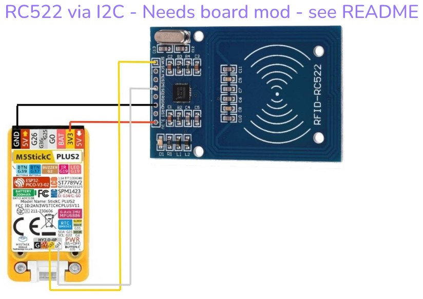

# Connections

## RC522

### Via SPI

### Via I2C

Connecting a RC522 via I2C needs a board mod to work.

More information can be found here: https://forum.arduino.cc/t/rc522-rfid-rc522-switching-spi-to-uart-interface-or-i2c-possible/425741

